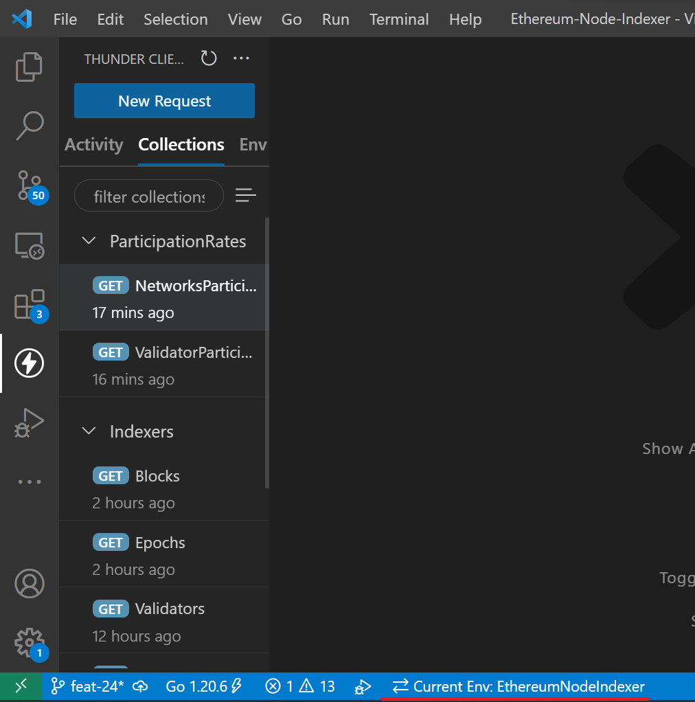
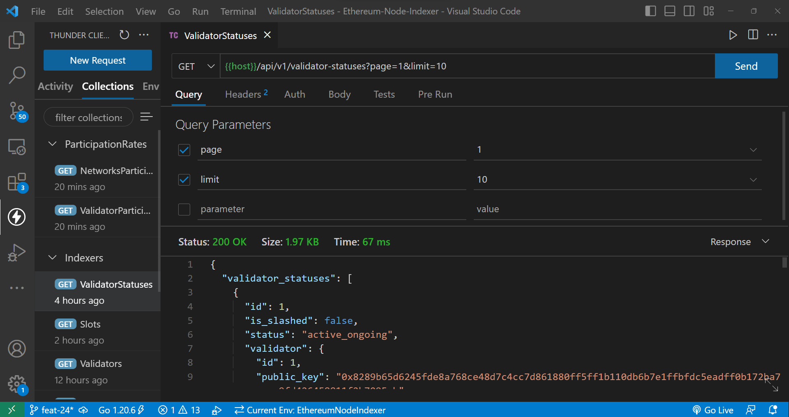

# Ethereum-Node-Indexer
This application is an indexer for Ethereum's Consensus Layer (Beacon Chain). We can fetch the network's participation rate and an individual validator's participation rate.

## Clone the project
```
git clone http://github.com/SidVermaS/Ethereum-Node-Indexer
```

## Project Setup
In order to run and test the application, there are some software and tools that are needed to be installed. (You can skip if you already have the mentioned software).

1. Download and install Docker desktop according to your operating system from the following link: 
https://www.docker.com/products/docker-desktop/
2. Download and install Visual Studio. It is needed to test the APIs. Download it from the following link:
https://code.visualstudio.com/download
3. Open the **Ethereum-Node-Indexer** repository in vsCode.
4. In order to run the Dockerized application you need to execute the following command
```cmd
docker-compose up
```

## Explore the APIs
Once the docker image is completely deployed then you can start exploring the APIs.
1. Select the extensions icon on the left side bar of vsCode, search "*thunder client*" and install it.

2. A thunder client icon will be visible on the left side bar. You can select it.

3. Select the options icon on top right side of the thunder client side bar. Select **Extension Settings** from the list of options.

4. Check the checkbox for *Thunder*-client: **Save To Workspace**.

5. Ensure that the selected current environment is EthereumNodeIndexer environment. 

6. You can open the collections and start testing the APIs.


## Testing
1. Open Docker desktop application and select the **Containers** option on the left sidebar.

2. Select the command line icon of the container with the name: **eni_server**.

3. Execute the following command:
```cmd
go test tests/main.go -v
```

